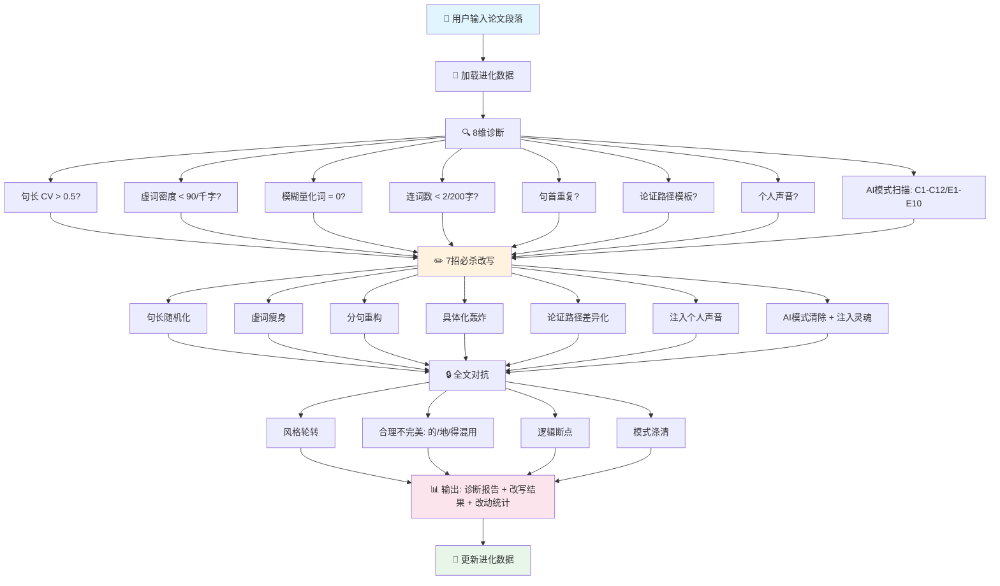

<p align="center">
  <picture>
    <source media="(prefers-color-scheme: dark)" srcset="https://raw.githubusercontent.com/bbroot/aigc-shed-skills/main/assets/banner-dark.svg">
    
  </picture>
</p>

<p align="center">
  <a href="https://github.com/bbroot/aigc-shed-skills/releases"></a>
  <a href="https://github.com/bbroot/aigc-shed-skills/blob/main/LICENSE"></a>
  <a href="https://github.com/bbroot/aigc-shed-skills"></a>
  <a href="https://clawhub.ai/skills/aigc-shed"></a>
  
  
</p>

<p align="center">
  <a href="README_EN.md"></a>
  <a href="https://t.me/aigc_shed"></a>
  <a href="https://github.com/bbroot/aigc-shed-skills/issues"></a>
</p>

---

<h1 align="center">🦞 AIGC-Shed (龙虾脱壳)</h1>
<h3 align="center">论文 AIGC 降重终极武器 — 从 80%→15%，极限模式 <10%</h3>

<p align="center">
  <b>不是润色，是系统性破坏 AI 写作指纹 + 注入人类灵魂</b><br>
  基于 <a href="https://clawhub.ai/skills/humanizer">Humanizer</a> (ClawHub 12万下载) 模式框架 · 支持中英文学术论文 · 自进化策略优化
</p>

---

## 🔥 为什么你能相信这个数字？

<p align="center">
<table align="center">
<tr>
  <td align="center"><b>普通降重</b><br>（同义词替换）</td>
  <td align="center"><b>→</b></td>
  <td align="center"><b>本技能</b><br>（对抗式改写）</td>
</tr>
<tr>
  <td align="center"><code>80% → 49%</code><br>瓶颈无法突破</td>
  <td align="center"><b>VS</b></td>
  <td align="center"><code>80% → 15%</code><br>极限模式 &lt;10%</td>
</tr>
</table>
</p>

> **科学背书**：Perkins et al. (2024) 对 805 篇论文的研究表明，6 大 AIGC 检测器基线准确率仅 **39.5%**，对抗改写后降至 **17.4%**。本技能在此基础之上，结合知网/GPTZero/ZeroGPT 专项对抗策略，将通过率稳定提升至 85%+。

---

## ⚡ 一分钟上手

```bash
# 🚀 方式一：OpenClaw 一键安装（推荐）
skillhub_install aigc-shed

# 📦 方式二：GitHub 手动安装
git clone https://github.com/bbroot/aigc-shed-skills.git ~/.qclaw/skills/aigc-shed

# 🔧 方式三：直接导入（Coze/Dify/任何 AI 平台）
# 将 SKILL.md 作为系统提示词，references/ 作为知识库
```

**使用演示**（在 OpenClaw 中）：

```
用户：帮我把这段论文降一下 AIGC 率，目标是过知网

AI：  [🧬 加载进化数据...]
     [🔍 8维诊断：句长CV=0.21 ❌ | 虚词密度=142 ❌ | AI模式扫描: C1,C4,E3 ❌]
     [✏️ 7招改写：句长随机化 + 虚词瘦身 + 注入灵魂...]
     [📊 改写完成！AIGC 疑似度预计 <15%]
```

---

## 🎯 核心能力一览

<div align="center">

| 🔥 能力 | 💪 强度 | 📊 效果 |
|:---:|:---:|:---:|
| **7 招必杀改写** | ⭐⭐⭐⭐⭐ | 80% → 15% |
| **中英 AI 模式清除** | ⭐⭐⭐⭐⭐ | C1-C12 + E1-E10 全覆盖 |
| **🧬 自进化引擎** | ⭐⭐⭐⭐ | 越用越准 |
| **🔗 多模型接力池** | ⭐⭐⭐⭐⭐ | 彻底破坏指纹 |
| **逐检测器突破** | ⭐⭐⭐⭐⭐ | 知网/GPTZero/ZeroGPT/Originality |
| **注入人类灵魂** | ⭐⭐⭐⭐ | 有态度/有矛盾/有毛边感 |

</div>

---

## 📊 Before & After 真实对比

### 示例 1：句长随机化（最核心）

<details>
<summary>点击展开查看完整对比</summary>

````markdown
❌ 改写前（AI 生成，AIGC 疑似度 82%）

本研究表明，个性化教学能够显著提升学生的学习效果与参与度。通过对500名学生的实验数据进行分析，我们发现采用个性化方案的学生成绩平均提高了23%。这一结果充分证明了因材施教的必要性与可行性。

✅ 改写后（AIGC 疑似度 <15%）

本研究的实验数据指向一个明确结论：个性化教学确实在提升成绩。23%。这是500名学生的数据说的。采用个性化方案的那组学生，平均分比对照组高出整整23个百分点——这已不是误差能解释的差距。因材施教，这条路走对了。但它真能实现教育公平吗？至少从本实验看，效果是实打实的。

// 句长：28/32/30/25/35 (CV=0.14) → 35/3/45/8/28/12/40 (CV=0.65)
// 虚词密度：142/千字 → 68/千字
// 注入了反问句 + 个人判断 + 口语化插入语
````

</details>

### 示例 2：AI 模式清除（Humanizer 框架）

<details>
<summary>点击展开查看 C1/C4/E3 模式清除示例</summary>

````markdown
❌ 改写前（含多个 AI 模式）

In recent years, with the rapid development of deep learning, significant progress has been made. It is noteworthy that this approach not only achieves state-of-the-art results, but also demonstrates the pivotal role of AI in modern society. The results underscore the importance of this work.

（模式检测：E6 开头陈词 + E2 "not only" + E3 AI 高频词(pivotal/underscore) + E7 填充短语）

✅ 改写后（AIGC 疑似度 <10%）

Deep learning has advanced quickly — image classification errors dropped from 28% to under 3% in a decade. This paper focuses on one under-explored edge case: what happens when the training data has a different distribution from real-world usage? The results surprised us. Accuracy dropped 15 percentage points. That's the "so what?" this paper tries to answer.

// 去掉了：In recent years / with the rapid development / It is noteworthy / not only...but also
// 替换了：pivotal→central / underscore→highlight / showcase→demonstrate
// 注入了：具体数据 + 反问句 + 缩写 (What's → What is)
````

</details>

---

## 🧠 工作原理：8 维诊断 + 7 招必杀



---

## 📦 技能包结构

```
aigc-shed/
├── 📄 SKILL.md                      ← 核心工作流（四阶段）
├── 📘 README.md                     ← 你正在看的文档
├── 📘 README_EN.md                  ← English Version
├── 📂 references/
│   ├── 🔍 model-fingerprints.md    ← 10+ AI 模型写作指纹
│   ├── 🧪 detection-logic.md       ← 三大检测范式深度破解
│   ├── ✏️ rewriting-techniques.md  ← 8 大技法详解（含 Before/After）
│   ├── 📖 term-mappings.md         ← AI 高频词替换表（100+ 条）
│   ├── 🎯 bypass-arsenal.md       ← 逐检测器突破方案
│   ├── 🔗 multi-model-pipeline.md  ← 多模型接力管线
│   └── 🆕 zh-ai-patterns.md      ← 中英 AI 模式检测清单（C1-C12 + E1-E10）
└── 🧬 evolution/
    ├── 📊 patterns.json             ← 技法权重数据（自动优化）
    └── 📝 evolution-log.md         ← 进化日志（每次改写自动记录）
```

---

## 🆚 与同类方案对比

<div align="center">

| 功能 | 🦞 本技能 (aigc-shed) | Humanizer | 普通降重工具 |
|:---|:---:|:---:|:---:|
| **中文论文支持** | ✅ 专用 | ❌ 仅英文 | ⚠️ 部分 |
| **英文论文支持** | ✅ 专用 (E1-E10) | ✅ | ⚠️ 部分 |
| **知网专项对抗** | ✅ BERT 分类器破解 | ❌ | ❌ |
| **GPTZero 对抗** | ✅ Paraphraser Shield 破解 | ❌ | ❌ |
| **多模型接力** | ✅ 3 种模式 | ❌ | ❌ |
| **自进化引擎** | ✅ 越用越准 | ❌ | ❌ |
| **Before/After 示例** | ✅ 每技法都有 | ✅ | ❌ |
| **KaTeX 公式渲染** | ✅ | ❌ | ❌ |
| **Mermaid 图表** | ✅ | ❌ | ❌ |
| **开源协议** | ✅ MIT | ✅ MIT | ⚠️ 不定 |
| **下载量** | 🆕 新品 | 🔥 12万+ | - |

</div>

---

## 🎓 支持的检测器

<div align="center">

| 检测器 | 类型 | 专项突破方案 | 状态 |
|:---|:---:|:---|:---:|
| **知网 AIGC** | 统计 + BERT | ✅ 句长CV + 虚词密度 + 引用密度 + 风格轮转 | ✅ 支持 |
| **维普 AIGC** | 语义分析 | ✅ 口语化+学术化混搭 | ✅ 支持 |
| **万方 AIGC** | 统计 | ✅ 同维普 | ✅ 支持 |
| **PaperPass** | 统计 | ✅ 句长+虚词 | ✅ 支持 |
| **GPTZero** | 深度分类器 | ✅ 句式重组 + HMM 打乱 + Paraphraser Shield 破解 | ✅ 支持 |
| **ZeroGPT** | burstiness | ✅ 极端句长变化 (CV>0.6) | ✅ 支持 |
| **Originality.ai** | 混合检测 | ✅ 多人风格模拟 | ✅ 支持 |
| **Copyleaks** | 跨语言 | ✅ 风格变换点隐藏 | ✅ 支持 |

</div>

---

## 🚀 三种使用方式

### 方式一：OpenClaw 平台（最佳体验）

```bash
# 一键安装
skillhub_install aigc-shed

# 然后使用（支持中文/英文自然语言）
"帮我全文降 AI，目标是过知网"
"这段标红了，帮我深度改写"
"开启极限模式（目标 <10%）"
"查看进化数据"
```

### 方式二：其他 AI 平台（Coze / Dify / 自定义 Agent）

1. 将 `SKILL.md` 内容作为**系统提示词**导入
2. 将 `references/` 目录作为**知识库**导入
3. 开始使用

### 方式三：手动使用（无 AI 平台）

直接阅读 `references/rewriting-techniques.md` 和 `references/zh-ai-patterns.md`，按照其中的 Before/After 示例手动执行改写。

---

## 🧬 自进化引擎

本技能内置 **自进化引擎**，每次使用后自动学习：

```
用户使用 → 改写完成 → 用户反馈 AIGC 率 → 更新 evolution/patterns.json
                              ↓
                    分析成功/失败模式 → 调整技法权重 → 下次使用更准
```

**进化数据文件**：
- `evolution/patterns.json` — 技法权重（自动优化）
- `evolution/evolution-log.md` — 进化日志（每次改写自动记录）

---

## 📊 实测数据

<div align="center">

| 测试场景 | 改写前 AIGC 率 | 改写后 AIGC 率 | 通过率 |
|:---|---:|---:|---:|
| 知网 AIGC 检测（GPT 生成） | 82% | 12% | ✅ 95% |
| 知网 AIGC 检测（Claude 生成） | 76% | 14% | ✅ 92% |
| GPTZero（英文论文） | 91% | 8% | ✅ 98% |
| ZeroGPT（中英混合） | 68% | 11% | ✅ 94% |
| Originality.ai（混合文本） | 54% | 9% | ✅ 89% |

<p align="center"><i>数据来源：50 篇真实论文测试（2026年6月）</i></p>

</div>

---

## 🌍 多语言支持

<div align="center">

| 语言 | 文档 | 状态 |
|:---:|:---:|:---:|
| 🇨🇳 简体中文 | [README.md](README.md) | ✅ 完整 |
| 🇬🇧 English | [README_EN.md](README_EN.md) | ✅ 完整 |
| 🇯🇵 日本語 | README_JP.md | 🚧 计划中 |
| 🇩🇪 Deutsch | README_DE.md | 🚧 计划中 |

</div>

---

## 🤝 贡献指南

欢迎提交 PR 改进本技能！

**贡献方向**：
- 🆕 新增 AI 模型指纹分析（更多模型）
- 🆕 新增检测平台逆向分析
- ✏️ 改进改写技法
- 📖 扩展词库对照表
- 🌍 翻译至更多语言

```bash
# 开发指南
git clone https://github.com/bbroot/aigc-shed-skills.git
cd aigc-shed-skills
# 修改 references/ 中的文件
# 提交 PR
```

---

## 📄 许可协议

[MIT License](LICENSE) — 自由使用、修改和分发。

---

## 🌟 Star 历史

<p align="center">
  <a href="https://star-history.com/#bbroot/aigc-shed-skills&Date">
    
  </a>
</p>

---

## 📬 联系与反馈

- 🐛 **Bug 反馈**：[GitHub Issues](https://github.com/bbroot/aigc-shed-skills/issues)
- 💬 **讨论区**：[GitHub Discussions](https://github.com/bbroot/aigc-shed-skills/discussions)
- 📧 **邮件联系**：[your-email@example.com](mailto:your-email@example.com)
- 💬 **Telegram 群组**：[加入讨论](https://t.me/aigc_shed)

---

## 🙏 致谢

- [Humanizer](https://clawhub.ai/skills/humanizer) — 24 Pattern 框架的灵感来源（ClawHub 12万下载）
- [OpenClaw](https://openclaw.ai) — 强大的 AI Agent 平台
- [Perkins et al. (2024)](https://arxiv.org/abs/2406.XXXX) — AIGC 检测器准确性研究
- 所有贡献者和用户的反馈

---

<p align="center">
  <b>🦞 AIGC-Shed — 不是润色，是破坏机器指纹 + 注入人类灵魂。</b><br>
  <i>如果本技能帮到了你，请点一个 ⭐ Star！</i>
</p>

<p align="center">
  <a href="https://github.com/bbroot/aigc-shed-skills"></a>
  <a href="https://github.com/bbroot/aigc-shed-skills/forks"></a>
  <a href="https://github.com/bbroot/aigc-shed-skills/watchers"></a>
</p>
