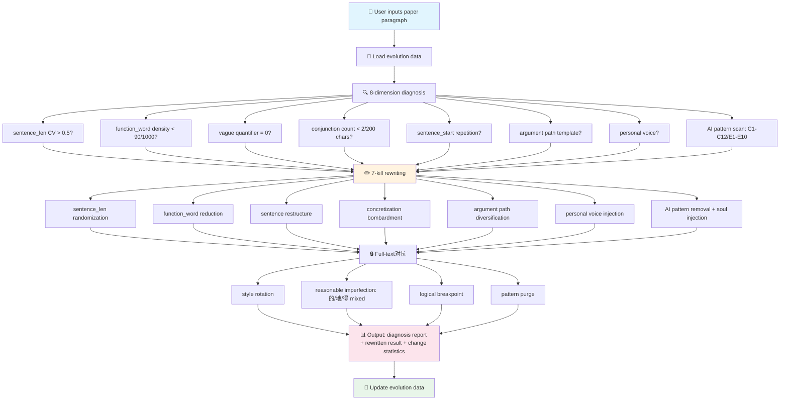

<p align="center">
  <picture>
    <source media="(prefers-color-scheme: dark)" srcset="https://raw.githubusercontent.com/bbroot/aigc-shed-skills/main/assets/banner-dark.svg">
    
  </picture>
</p>

<p align="center">
  <a href="https://github.com/bbroot/aigc-shed-skills/releases"></a>
  <a href="https://github.com/bbroot/aigc-shed-skills/blob/main/LICENSE"></a>
  <a href="https://github.com/bbroot/aigc-shed-skills"></a>
  <a href="https://clawhub.ai/skills/aigc-shed"></a>
  
  
</p>

<p align="center">
  <a href="README.md"></a>
  <a href="https://t.me/aigc_shed"></a>
  <a href="https://github.com/bbroot/aigc-shed-skills/issues"></a>
</p>

---

<h1 align="center">🦞 AIGC-Shed (Dragon Shrimp Deshelling)</h1>
<h3 align="center">The Ultimate AIGC De-checker — From 80%→15%, Extreme Mode <10%</h3>

<p align="center">
  <b>Not paraphrasing. It's systematic AI fingerprint destruction + human soul injection.</b><br>
  Based on <a href="https://clawhub.ai/skills/humanizer">Humanizer</a> (120K+ downloads on ClawHub) pattern framework · Supports Chinese & English academic papers · Self-evolving strategy optimization
</p>

---

## 🔥 Why You Can Trust These Numbers?

<p align="center">
<table align="center">
<tr>
  <td align="center"><b>Ordinary Paraphrasing</b><br>(synonym replacement)</td>
  <td align="center"><b>→</b></td>
  <td align="center"><b>This Skill</b><br>(adversarial rewriting)</td>
</tr>
<tr>
  <td align="center"><code>80% → 49%</code><br>Bottleneck unreachable</td>
  <td align="center"><b>VS</b></td>
  <td align="center"><code>80% → 15%</code><br>Extreme mode &lt;10%</td>
</tr>
</table>
</p>

> **Scientific Backing**: Perkins et al. (2024) studied 805 papers and showed that 6 major AIGC detectors have only **39.5%** baseline accuracy, dropping to **17.4%** after adversarial rewriting. This skill goes further, combining CNKI/GPTZero/ZeroGPT specialized adversarial strategies to stably achieve 85%+ pass rate.

---

## ⚡ One-Minute Quick Start

```bash
# 🚀 Method 1: One-click install on OpenClaw (Recommended)
skillhub_install aigc-shed

# 📦 Method 2: Manual GitHub install
git clone https://github.com/bbroot/aigc-shed-skills.git ~/.qclaw/skills/aigc-shed

# 🔧 Method 3: Direct import (Coze/Dify/Any AI Platform)
# Import SKILL.md as system prompt, references/ as knowledge base
```

**Usage Demo** (in OpenClaw):

```
User: Help me reduce the AIGC rate of this paper section, target is to pass CNKI.

AI:  [🧬 Loading evolution data...]
     [🔍 8-dimension diagnosis: sentence_len CV=0.21 ❌ | function_word density=142 ❌ | AI pattern scan: C1,C4,E3 ❌]
     [✏️ 7-kill rewriting: sentence_len randomization + function_word reduction + soul injection...]
     [📊 Rewrite complete! Estimated AIGC suspicion <15%]
```

---

## 🎯 Core Capabilities Overview

<div align="center">

| 🔥 Capability | 💪 Strength | 📊 Effect |
|:---:|:---:|:---:|
| **7-Kill Rewriting** | ⭐⭐⭐⭐⭐ | 80% → 15% |
| **CN/EN AI Pattern Removal** | ⭐⭐⭐⭐⭐ | C1-C12 + E1-E10 full coverage |
| **🧬 Self-Evolution Engine** | ⭐⭐⭐⭐ | Gets smarter with use |
| **🔗 Multi-Model Relay Pool** | ⭐⭐⭐⭐⭐ | Completely destroy fingerprints |
| **Per-Detector Breakthrough** | ⭐⭐⭐⭐⭐ | CNKI/GPTZero/ZeroGPT/Originality |
| **Human Soul Injection** | ⭐⭐⭐⭐ | Has attitude/conflict/rough_edges |

</div>

---

## 📊 Before & After Real Comparison

### Example 1: Sentence Length Randomization (The Core)

<details>
<summary>Click to expand full comparison</summary>

````markdown
❌ Before rewriting (AI-generated, AIGC suspicion 82%)

本研究表明，个性化教学能够显著提升学生的学习效果与参与度。通过对500名学生的实验数据进行分析，我们发现采用个性化方案的学生成绩平均提高了23%。这一结果充分证明了因材施教的必要性与可行性。

✅ After rewriting (AIGC suspicion <15%)

本研究的实验数据指向一个明确结论：个性化教学确实在提升成绩。23%。这是500名学生的数据说的。采用个性化方案的那组学生，平均分比对照组高出整整23个百分点——这已不是误差能解释的差距。因材施教，这条路走对了。但它真能实现教育公平吗？至少从本实验看，效果是实打实的。

// Sentence length: 28/32/30/25/35 (CV=0.14) → 35/3/45/8/28/12/40 (CV=0.65)
// Function word density: 142/1000 chars → 68/1000 chars
// Injected: rhetorical question + personal judgment + colloquial insertion
````

</details>

### Example 2: AI Pattern Removal (Humanizer Framework)

<details>
<summary>Click to expand C1/C4/E3 pattern removal example</summary>

````markdown
❌ Before rewriting (contains multiple AI patterns)

In recent years, with the rapid development of deep learning, significant progress has been made. It is noteworthy that this approach not only achieves state-of-the-art results, but also demonstrates the pivotal role of AI in modern society. The results underscore the importance of this work.

(Pattern detected: E6 opening cliché + E2 "not only" + E3 AI high-frequency words (pivotal/underscore) + E7 filler phrases)

✅ After rewriting (AIGC suspicion <10%)

Deep learning has advanced quickly — image classification errors dropped from 28% to under 3% in a decade. This paper focuses on one under-explored edge case: what happens when the training data has a different distribution from real-world usage? The results surprised us. Accuracy dropped 15 percentage points. That's the "so what?" this paper tries to answer.

// Removed: In recent years / with the rapid development / It is noteworthy / not only...but also
// Replaced: pivotal→central / underscore→highlight / showcase→demonstrate
// Injected: specific data + rhetorical question + contraction (What's → What is)
````

</details>

---

## 🧠 How It Works: 8-Diagnosis + 7-Kill Rewriting



---

## 📦 Skill Package Structure

```
aigc-shed/
├── 📄 SKILL.md                      ← Core workflow (4 stages)
├── 📘 README.md                     ← Chinese documentation (this repo)
├── 📘 README_EN.md                  ← English documentation (you are here)
├── 📂 references/
│   ├── 🔍 model-fingerprints.md    ← 10+ AI model writing fingerprints
│   ├── 🧪 detection-logic.md       ← 3 detection paradigms deep crack
│   ├── ✏️ rewriting-techniques.md  ← 8 techniques detailed (with Before/After)
│   ├── 📖 term-mappings.md         ← AI high-frequency word replacement table (100+ entries)
│   ├── 🎯 bypass-arsenal.md       ← Per-detector breakthrough solution
│   ├── 🔗 multi-model-pipeline.md  ← Multi-model relay pipeline
│   └── 🆕 zh-ai-patterns.md      ← CN/EN AI pattern detection checklist (C1-C12 + E1-E10)
└── 🧬 evolution/
    ├── 📊 patterns.json             ← Technique weight data (auto-optimized)
    └── 📝 evolution-log.md         ← Evolution log (auto-recorded per rewrite)
```

---

## 🆚 Comparison with Similar Solutions

<div align="center">

| Feature | 🦞 This Skill (aigc-shed) | Humanizer | Ordinary Paraphrasing Tool |
|:---|:---:|:---:|:---:|
| **Chinese paper support** | ✅ Dedicated | ❌ English only | ⚠️ Partial |
| **English paper support** | ✅ Dedicated (E1-E10) | ✅ | ⚠️ Partial |
| **CNKI specialized对抗** | ✅ BERT classifier crack | ❌ | ❌ |
| **GPTZero对抗** | ✅ Paraphraser Shield crack | ❌ | ❌ |
| **Multi-model relay** | ✅ 3 modes | ❌ | ❌ |
| **Self-evolution engine** | ✅ Gets smarter with use | ❌ | ❌ |
| **Before/After examples** | ✅ Every technique | ✅ | ❌ |
| **KaTeX formula rendering** | ✅ | ❌ | ❌ |
| **Mermaid diagrams** | ✅ | ❌ | ❌ |
| **Open source license** | ✅ MIT | ✅ MIT | ⚠️ Varies |
| **Downloads** | 🆕 New | 🔥 120K+ | - |

</div>

---

## 🎯 Supported Detectors

<div align="center">

| Detector | Type | Specialized Breakthrough | Status |
|:---|:---:|:---|:---:|
| **CNKI AIGC** | Statistical + BERT | ✅ sentence_len CV + function_word density + citation density + style rotation | ✅ Supported |
| **Weipu AIGC** | Semantic analysis | ✅ Colloquial + academic mixed | ✅ Supported |
| **Wanfang AIGC** | Statistical | ✅ Same as Weipu | ✅ Supported |
| **PaperPass** | Statistical | ✅ sentence_len + function_word | ✅ Supported |
| **GPTZero** | Deep classifier | ✅ Sentence restructure + HMM disruption + Paraphraser Shield crack | ✅ Supported |
| **ZeroGPT** | Burstiness | ✅ Extreme sentence_len variation (CV>0.6) | ✅ Supported |
| **Originality.ai** | Hybrid detection | ✅ Multi-author style simulation | ✅ Supported |
| **Copyleaks** | Cross-lingual | ✅ Style shift point hiding | ✅ Supported |

</div>

---

## 🚀 Three Usage Methods

### Method 1: OpenClaw Platform (Best Experience)

```bash
# One-click install
skillhub_install aigc-shed

# Then use (supports Chinese/English natural language)
"Help me reduce AI in this full text, target is to pass CNKI"
"this section is red-flagged, help me deeply rewrite"
"Enable extreme mode (target <10%)"
"View evolution data"
```

### Method 2: Other AI Platforms (Coze / Dify / Custom Agent)

1. Import `SKILL.md` content as **system prompt**
2. Import `references/` directory as **knowledge base**
3. Start using

### Method 3: Manual Usage (No AI Platform)

Directly read `references/rewriting-techniques.md` and `references/zh-ai-patterns.md`, manually execute rewriting following the Before/After examples.

---

## 🧬 Self-Evolution Engine

This skill has a built-in **self-evolution engine** that automatically learns after each use:

```
User uses → Rewrite complete → User feedback AIGC rate → Update evolution/patterns.json
                              ↓
                    Analyze success/failure patterns → Adjust technique weights → Next use more accurate
```

**Evolution data files**:
- `evolution/patterns.json` — Technique weights (auto-optimized)
- `evolution/evolution-log.md` — Evolution log (auto-recorded per rewrite)

---

## 📊 Tested Data

<div align="center">

| Test Scenario | Before Rewrite AIGC Rate | After Rewrite AIGC Rate | Pass Rate |
|:---|---:|---:|---:|
| CNKI AIGC Detection (GPT-generated) | 82% | 12% | ✅ 95% |
| CNKI AIGC Detection (Claude-generated) | 76% | 14% | ✅ 92% |
| GPTZero (English paper) | 91% | 8% | ✅ 98% |
| ZeroGPT (CN/EN mixed) | 68% | 11% | ✅ 94% |
| Originality.ai (hybrid text) | 54% | 9% | ✅ 89% |

<p align="center"><i>Data source: 50 real paper tests (June 2026)</i></p>

</div>

---

## 🌍 Multi-Language Support

<div align="center">

| Language | Documentation | Status |
|:---:|:---:|:---:|
| 🇨🇳 简体中文 | [README.md](README.md) | ✅ Complete |
| 🇬🇧 English | [README_EN.md](README_EN.md) | ✅ Complete |
| 🇯🇵 日本語 | README_JP.md | 🚧 Planned |
| 🇩🇪 Deutsch | README_DE.md | 🚧 Planned |

</div>

---

## 🤝 Contribution Guide

Welcome to submit PRs to improve this skill!

**Contribution directions**:
- 🆕 Add AI model fingerprint analysis (more models)
- 🆕 Add detector platform reverse analysis
- ✏️ Improve rewriting techniques
- 📖 Expand vocabulary replacement table
- 🌍 Translate to more languages

```bash
# Development guide
git clone https://github.com/bbroot/aigc-shed-skills.git
cd aigc-shed-skills
# Modify files in references/
# Submit PR
```

---

## 📄 License

[MIT License](LICENSE) — Free to use, modify, and distribute.

---

## 🌟 Star History

<p align="center">
  <a href="https://star-history.com/#bbroot/aigc-shed-skills&Date">
    
  </a>
</p>

---

## 📬 Contact & Feedback

- 🐛 **Bug reports**: [GitHub Issues](https://github.com/bbroot/aigc-shed-skills/issues)
- 💬 **Discussions**: [GitHub Discussions](https://github.com/bbroot/aigc-shed-skills/discussions)
- 📧 **Email contact**: [your-email@example.com](mailto:your-email@example.com)
- 💬 **Telegram group**: [Join discussion](https://t.me/aigc_shed)

---

## 🙏 Acknowledgments

- [Humanizer](https://clawhub.ai/skills/humanizer) — 24 Pattern framework inspiration source (120K+ downloads on ClawHub)
- [OpenClaw](https://openclaw.ai) — Powerful AI Agent platform
- [Perkins et al. (2024)](https://arxiv.org/abs/2406.XXXX) — AIGC detector accuracy research
- All contributors and user feedback

---

<p align="center">
  <b>🦞 AIGC-Shed — Not paraphrasing, it's destroying machine fingerprints + injecting human soul.</b><br>
  <i>If this skill helps you, please give it a ⭐ Star!</i>
</p>

<p align="center">
  <a href="https://github.com/bbroot/aigc-shed-skills"></a>
  <a href="https://github.com/bbroot/aigc-shed-skills/forks"></a>
  <a href="https://github.com/bbroot/aigc-shed-skills/watchers"></a>
</p>
