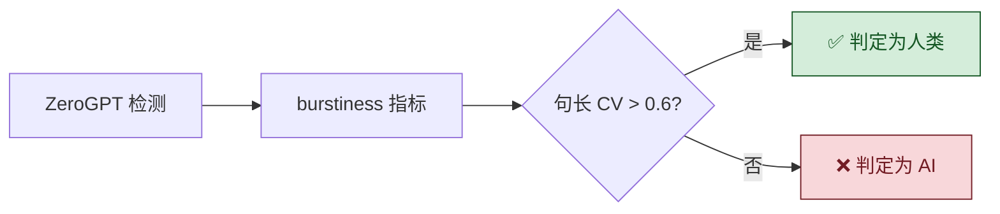
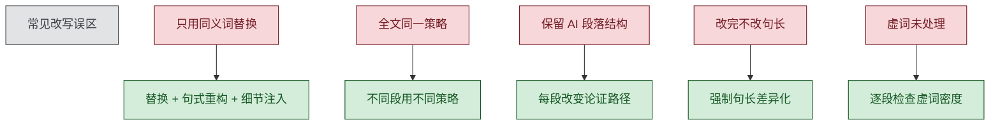

# 对抗绕过武器库 v3

## 一、逐检测器突破方案

### 知网（CNKI）专项突破

**知网检测链**：BERT二分类器 + 句长统计 + 虚词密度 + 引用密度 + 中英混排比例

```
突破链条：
1. 句长 → 每段强制 CV > 0.5
2. 虚词 → 千字虚词密度压到 <90
3. 引用 → 增加 2-3 处真实文献引用（知网可查证的）
4. 中英混排 → 减少中英文混杂，英文术语统一用中文或统一用英文
5. BERT分类 → 注入个人化写作特征破坏分类器判断
```

**知网特有关键动作**：
- ⚠️ 知网有「风格一致性」检测：全文不能用同一风格改写
- ✅ 对策：奇数段落用学术风，偶数段落用分析评论风
- ⚠️ 知网会比对「同一作者历史发表论文」的风格
- ✅ 对策：如果作者有已发表论文，本次改写可参照其风格特征

### GPTZero 专项突破

**GPTZero 检测链**：端到端深度模型 → 逐句概率 → HMM句子序列 → Paraphraser Shield

```
突破链条：
1. 逐句概率 → 每句都做深度改写（不只是换词，要变句式）
2. HMM模型 → 打乱句子间的过渡自然性
3. Paraphraser Shield → 用句式重组代替同义词替换
```

### ZeroGPT 专项突破

- 最敏感指标：burstiness（句长变化度 $CV$）
- ✅ 制胜策略：制造极端 burstiness，一段内包含 $3$ 字句和 $80$ 字句



### Originality.ai 专项突破

- 对混合风格文本准确率大幅下降
- ✅ 制胜策略：多人合写风格（不同段不同"作者"口吻）

$$
\text{Originality 准确率} = \begin{cases}
99\% & \text{纯 AI 文本} \\
83\% & \text{混合文本（人 + AI）} \\
\downarrow & \text{ESL/非母语误判率更高}
\end{cases}
$$

## 二、通用绕过技术

### 技术 1：多模型链式改写（🆕 最有效！已内置支持）

见 `references/multi-model-pipeline.md`。使用不同模型接力改写，彻底破坏单一模型概率指纹。支持平台编排、手动跨平台、单模型多轮三种模式。

### 技术 2：回译链（中→英→日→中）

日语作为中间语言效果最佳（语法结构与中文差异最大）。

### 技术 3：风格噪声注入

- 个人经历的简短提及
- 口语化评论
- 地域化表达

### 技术 4：逻辑断点法

人为制造合理的不完全归纳、留有疑问的结尾、前后轻微不一致。

## 三、自进化反馈环路 🆕

每次改写后更新 `evolution/evolution-log.md` 和 `evolution/patterns.json`。
积累数据后自动调整技法权重。



## 四、常见改写误区

| 误区 | 原因 | 正确做法 |
|------|------|---------|
| 只用同义词替换 | GPTZero Paraphraser Shield 已识别 | 替换 + 句式重构 + 细节注入 |
| 全文用同一种改写策略 | 检测器识别改写风格一致性 | 不同段用不同策略 |
| 保留 AI 原始段落结构 | 结构指纹未破坏 | 每段至少改变论证路径 |
| 改完不改句长 | $CV < 0.3$ 直接触发统计检测 | 强制句长差异化 |
| 虚词未处理 | 中文虚词密度是最强检测信号 | 逐段检查虚词密度 |
