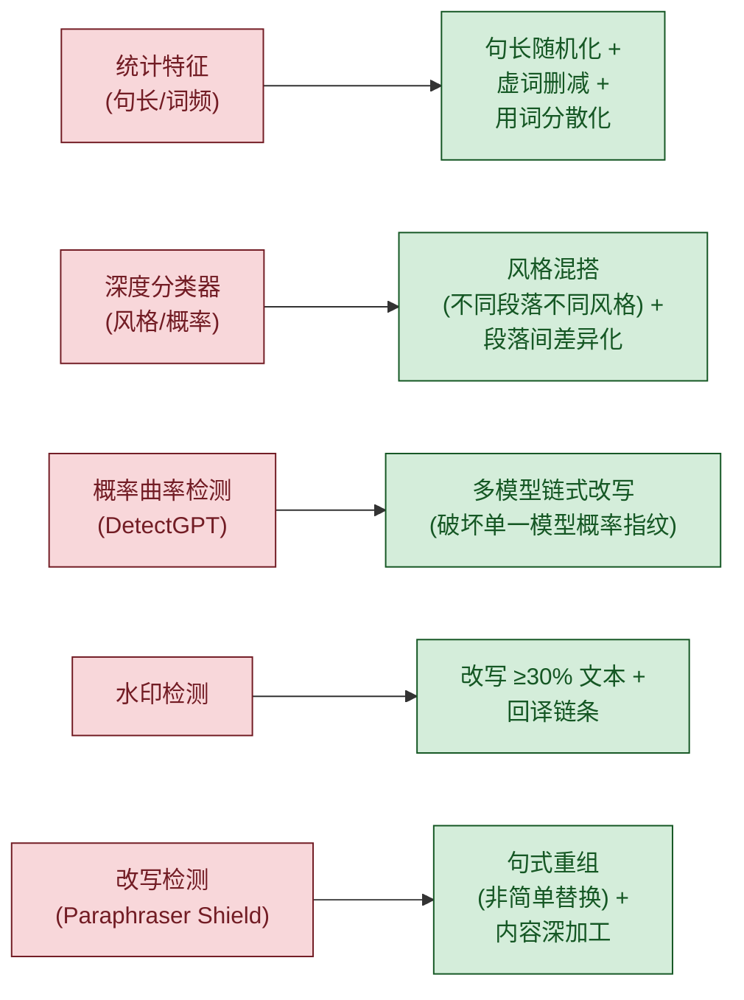

# AIGC 检测系统深度破解手册

## 一、检测技术三大范式

### 范式 1：统计异常检测（国内主流：知网/维普/万方/PaperPass/格子达）

国内检测器主要采用统计特征分析，核心指标：

| 指标 | AI特征值 | 人类特征值 | 破解方法 |
|------|---------|-----------|---------|
| 句长变异系数 $CV = \frac{\sigma}{\mu}$ | $<0.3$ | $>0.5$ | 强制制造句长方差：插入 $<8$ 字短句 $+ >50$ 字长句 |
| 虚词密度（每千字） | $>120$ | $80$-$100$ | 删减"的""了""是""在""和""与""及""等" |
| 连词密度（每千字） | $>15$ | $5$-$10$ | 删除或替换"首先其次最后""此外""另外""同时" |
| 模糊量化词比例 | $>40\%$ | $15\%$-$25\%$ | 将"显著""大幅""一定程度"替换为具体数字 |
| 句首重复率 | $>20\%$ | $<8\%$ | 确保相邻 $3$ 句句首词各不相同 |
| 的/地/得 正确率 | $>98\%$ | $70\%$-$85\%$ | 刻意制造 $1$-$2$ 处"的/地/得"混用（人类常犯） |

**知网 AIGC 检测特有逻辑**：
- 使用基于 BERT 微调的中文二分类模型（类似 CheckGPT）
- 训练数据包含 GPT 生成 + 知网收录的 5000 万篇论文
- 敏感于：① 中英混排比例异常 ② 引用密度过低 ③ 段落首尾句式一致
- **核心弱点**：对「原作者本人之前写作风格」无参照，检测的是「与人类整体写作的差异」

**维普 AIGC 检测**：
- 侧重内容语义分析 + 文本复用检测
- 敏感于：段落间语义跳跃过大或过小
- 弱点：对「口语化 + 学术化混搭」文本判定困难

### 范式 2：深度分类器（国际主流：GPTZero/Originality/Copyleaks）

GPTZero 的具体实现：
- 端到端深度神经网络（类似 BERT 变体），在 10M+ 文档上训练
- 逐句分类（Sentence Classifier）：对每个句子给出 AI/Human 概率
- 使用 Hidden Markov Model (HMM) 追踪句子间的 AI/Human 转换
- **Paraphraser Shield**：专门检测同义词替换改写！所以仅做词汇替换=失效
- 三分类：完全人类 / 完全 AI / 混合

Originality.ai：
- 训练数据涵盖 GPT-3/4、Claude、Gemini、Llama
- 精度声称 99%，但对混合文本（人+AI）降至 83%
- 对 ESL 写作者误判率更高（已被证实有偏见）

Copyleaks：
- 覆盖多语言（含中文），使用跨语言模型
- 敏感于写作风格一致性（全文风格变换点检测）
- 弱点：对「多人合写」风格的文本误判率高

### 范式 3：概率曲率检测（学术前沿：DetectGPT）

DetectGPT 原理：
- AI 模型生成的文本落在模型 log probability 函数的**负曲率区域**
- 人类文本不在这个区域
- 通过随机扰动（用另一个模型微调句子）后观察概率变化来判断
- **致命弱点**：只需要换一个不同的模型改写文本，就能打破曲率特征

## 二、各检测器弱点速查

> [!TIP]
> **核心原理**：Perkins et al. (2024) 对 $805$ 篇论文测试发现，$6$ 大检测器对抗改写后准确率从 $39.5\%$ 暴跌至 $17.4\%$，证实对抗方法有效。

### A 级弱点（可直接利用）

| 检测器 | 核心弱点 | 利用方式 |
|--------|---------|---------|
| 知网 | 无个人风格参照系 | 全文注入个人化表达 + 句长强制差异化 |
| GPTZero | 改写盾仅防御同义词替换 | 用句式重组 + 内容重写（非改写）突破 |
| DetectGPT | 依赖特定模型概率 | 换不同模型改写过即可突破 |
| ZeroGPT | 依赖 burstiness 指标 | 制造极端句长变化（$3$ 字 $\leftrightarrow$ $80$ 字） |

### B 级弱点（需配合使用）

| 检测器 | 核心弱点 | 利用方式 |
|--------|---------|---------|
| 维普 | 依赖段落连贯性 | 制造合理逻辑跳跃 |
| 万方 | 依赖引用密度 | 增加真实引用 |
| Originality | ESL 文本高误判 | 注入非母语特征（如中式英语） |
| Turnitin | 依赖整体特征 | 不同章节用不同风格 |

## 三、对抗策略矩阵

### 突发度公式

AI 文本的突发度（burstiness）即句长变异系数：

$$
CV = \frac{\sigma_{\text{sentence\_length}}}{\mu_{\text{sentence\_length}}}
$$

- AI 文本：$CV < 0.3$，句长集中在 $25$-$40$ 字区间
- 人类文本：$CV > 0.5$，句长分布跨度大
- **改写目标**：每段 $CV > 0.5$，极限目标 $> 0.6$

## 四、为什么普通改写方法无效

普通「降重」方法为什么只能从 80% 降到 49%，而无法跌破 30%：

1. **同义词替换被完美识别**：GPTZero 的 Paraphraser Shield 专门训练识别同义词替换模式
2. **只改词汇不改结构**：句子长度分布、段落结构、论证路径没变 → 统计特征检测器不变
3. **保留 AI 连贯性**：修改后的文本仍然逻辑完美 → 分类器高分
4. **未注入个人特征**：没有个人立场、细节数据、风格差异 → 检测器确认是机器

**突破 49% 瓶颈必须做到**：
- 至少 60% 的句子句式被重构（不只是换词）
- 全文句长 CV > 0.5
- 每 200 字至少 1 个具体数字或案例细节
- 段落间风格有明显差异
- 存在合理逻辑跳跃或不完美

