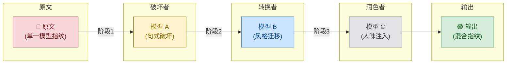

# 多模型接力池——接力改写管线

## 原理

单一模型改写=单一模型的概率指纹 → 检测器可追踪。
多模型接力改写=每个阶段引入不同模型的写作特征 → 指纹被混合稀释。



## 三阶段管线

| 阶段 | 角色 | 推荐模型 | 任务 |
|------|------|---------|------|
| 阶段1 | 破坏者 | 与原文**不同**的任意模型 | 激进句式重组 + 论证路径打乱 |
| 阶段2 | 转换者 | 第三种模型（不同于阶段1） | 风格迁移 + 虚词处理 |
| 阶段3 | 润色者 | 任意模型（人味注入） | 注入人味 + 质量校验 + 术语对齐 |

## 实现方式

### 方式 A：平台自动编排（支持子代理调度的平台）

如果你的 AI 平台支持多模型/子代理调用（如 OpenClaw sessions_spawn、Coze 多智能体、Dify 工作流）：

**阶段1 — 破坏者**：
```
提示词: 用激进方式重写以下学术段落。破坏所有AI句式特征，句长CV>0.6。
       不保留任何原始句子结构。可以使用非常规语序、片段句、反问句。

输入: [原文段落]
```

**阶段2 — 转换者**：
```
提示词: 对以下文本进行虚词瘦身(密度<80/千字)和风格平滑。
       保留核心观点和术语，但让表达方式更加自然多样。
       删除冗余的"的/了/是/在/和"等虚词。

输入: [阶段1输出]
```

**阶段3 — 润色者**：
```
提示词: 在以下学术文本中注入个人声音。添加1-2处个人评述("笔者认为")。
       将模糊表述替换为具体数据。制造1处合理的不完美(如的/地/得混用)。
       确保术语准确。

输入: [阶段2输出]
```

> **关键**：三个阶段必须使用**不同模型**或**不同推理参数**（如 temperature/role），确保每阶段输出有不同的概率分布特征。

### 方式 B：手动多模型模式（推荐，效果最佳）

如果可手动操作不同 AI 平台（网页版/API），最佳管线：

```
原文 → Claude（句式破坏：长句习惯反向打破原文格式化）
     → GPT-4o（风格翻译：平衡风格进一步混淆）
     → 任意模型（人味注入+术语对齐）
```

### 方式 C：单模型多轮模式

只有一个模型时，通过改变角色人设实现「伪多模型」：

```
第1轮: "你是激进的后现代文学评论家，用极其不规则的句式改写以下学术文本"
第2轮: "你是严谨的数据分析师，把所有模糊表述替换为具体数据"
第3轮: "你是有个人观点的学者，加入批判性思考和疑问"
```

> 每轮输出后**清空上下文**再开始下一轮，避免模型受到前一轮风格影响。

## 启动条件

多模型管线在以下情况触发：
- 用户要求「极限模式」或「多模型模式」
- 目标 AIGC 率 < 10%
- 用户环境支持多模型调用
